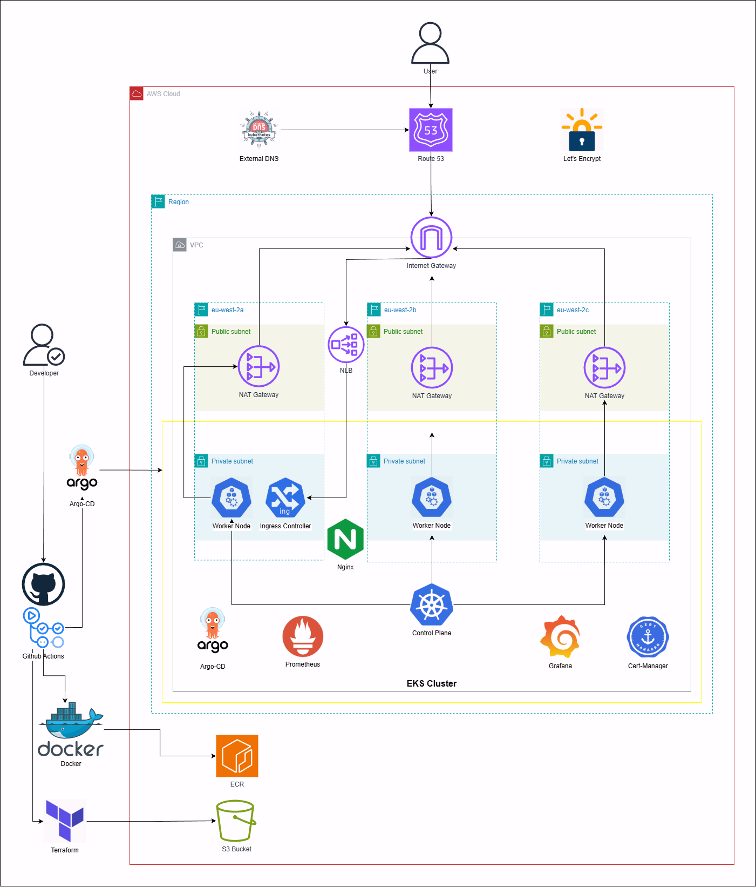
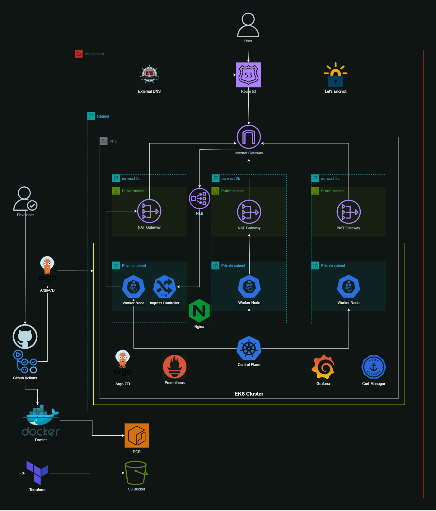

# K8s Deployment on AWS

## Diagram

<div align="center">
  <p><strong>Light mode</strong></p>
  
  <p><strong>Dark mode</strong></p>
  
</div>

## Overview

This project is a scalable, production-grade deployment of the 2048 game application on an EKS cluster. The deployment is spread across three AZs for high-availability and uses the EKS Managed Node Group service, allowing for streamlined scalability. Infrastructure deployments are automated using Terraform, and the application is containerised using Docker and deployed to a private container registry on AWS (ECR).

## Architecture

<div align="center">
  <p><strong>Light mode</strong></p>
  
  <p><strong>Dark mode</strong></p>
  
</div>

## Key features

- **External-dns**: Automatically updates DNS records in Route 53.
- **Cert-manager**: Provides DNS validation and digital certificates, as well as certificate management.
- **Helmfile**: Orchestrates K8s deployments across multiple Helm charts.
- **Prometheus/Grafana**: Fetches vital cluster logs/metrics and visualises them in readable dashboards.
- **Open ID Connect (OIDC)**: Use of JSON web tokens over access keys lifts the risks & responsibilities of key management and also enforces just-in-time permissions.

## Directory Structure

```
├── .github
│   └── workflows
│       ├── deploy.yaml
│       ├── docker-build.yaml
│       ├── terraform-apply.yaml
│       └── terraform-destroy.yaml
├── bootstrap
│   ├── backend.tf
│   ├── main.tf
│   └── ... (S3 + DynamoDB for Terraform state; separate from main stack)
├── deployment
│   ├── helmfile.yaml
│   ├── apps
│   │   └── game.yaml
│   ├── argo-cd
│   │   └── apps-argo.yaml
│   ├── cert-mgr
│   │   └── issuer.yaml
│   ├── helm-values
│   │   ├── argocd.yaml
│   │   ├── cert-manager.yaml
│   │   ├── external-dns.yaml
│   │   ├── grafana.yaml
│   │   ├── nginx-ingress.yaml
│   │   └── prometheus.yaml
│   ├── scripts
│   │   ├── deploy.sh
│   │   ├── destroy.sh
│   │   └── ...
│   └── terraform
│       ├── eks.tf
│       ├── vpc.tf
│       ├── pod-identities.tf
│       ├── providers.tf
│       ├── outputs.tf
│       └── locals.tf
└── src
    └── Dockerfile
```

