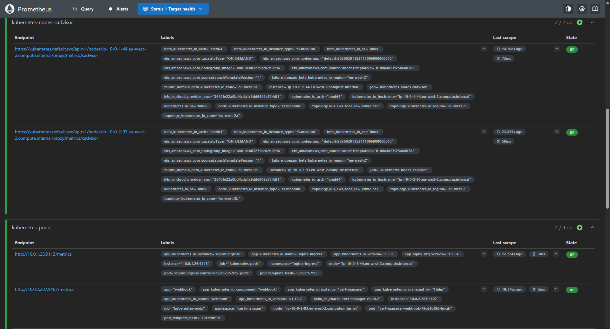
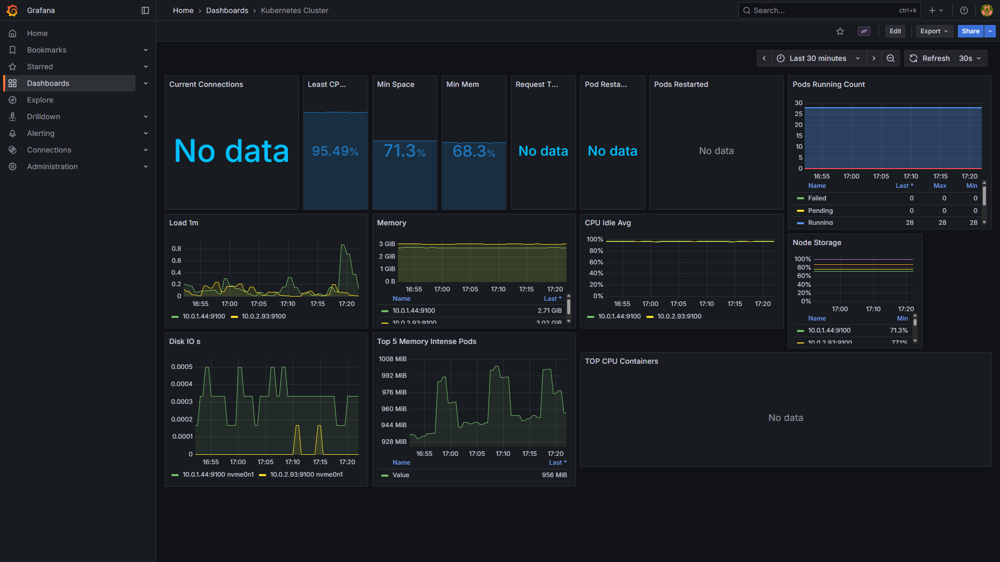

# Production-grade K8s deployment

## Diagram


## Overview

This project is a scalable, production-grade deployment of the 2048 game application on an EKS cluster. The deployment is spread across three AZs for high-availability and uses the EKS Managed Node Group service, allowing for streamlined scalability. Infrastructure deployments are automated using Terraform, and the application is containerised using Docker and deployed to a private container registry on AWS (ECR).

## Architecture


## Key features

- **External-dns**: Automatically updates DNS records in Route 53.
- **Cert-manager**: Provides DNS validation and digital certificates, as well as certificate management.
- **Helmfile**: Orchestrates K8s deployments across multiple Helm charts.
- **Prometheus/Grafana**: Fetches vital cluster logs/metrics and visualises them in readable dashboards.
- **Open ID Connect (OIDC)**: Use of JSON web tokens over access keys lifts the risks & responsibilities of key management and also enforces just-in-time permissions.

## Directory Structure

```
├── .github
│   └── workflows
│       ├── deploy.yaml
│       ├── docker-build.yaml
│       ├── terraform-apply.yaml
│       └── terraform-destroy.yaml
├── bootstrap
│   ├── backend.tf
│   ├── main.tf
│   └── ... (S3 + DynamoDB for Terraform state; separate from main stack)
├── deployment
│   ├── helmfile.yaml
│   ├── apps
│   │   └── game.yaml
│   ├── argo-cd
│   │   └── apps-argo.yaml
│   ├── cert-mgr
│   │   └── issuer.yaml
│   ├── helm-values
│   │   ├── argocd.yaml
│   │   ├── cert-manager.yaml
│   │   ├── external-dns.yaml
│   │   ├── grafana.yaml
│   │   ├── nginx-ingress.yaml
│   │   └── prometheus.yaml
│   ├── scripts
│   │   ├── deploy.sh
│   │   ├── destroy.sh
│   │   └── ...
│   └── terraform
│       ├── eks.tf
│       ├── vpc.tf
│       ├── pod-identities.tf
│       ├── providers.tf
│       ├── outputs.tf
│       └── locals.tf
└── src
    └── Dockerfile
```

## Docker

<div align="center">
  
</div>

- **Multistage builds**: Separates the application build from the final image, cutting image sizes by reducing build dependencies in the final image.
- **Image tagging**: Uses semantic versioning tags (`latest`) to enable reliable image management and deployment.
- **Nginx-based serving**: Uses `nginx:alpine` as the base image to efficiently serve static files, configured to listen on port 3000.
- **Trivy scans**: Scan images for any CVEs before they're pushed to ECR, ensuring security vulnerabilities are caught early in the pipeline.

## Terraform

<div align="center">
  
</div>

- **Community modules**: Implementation of DRY principles, using ready-made, reusable Terraform modules (EKS, VPC, Pod Identity).
- **Checkov**: Security scanning in CI pipelines enforces security best-practices in Terraform configurations, hardening infrastructure.
- **S3 backend**: Terraform state is stored in an S3 bucket with encryption enabled, enabling state locking and team collaboration.
- **VPC endpoints**: Private connectivity to AWS services (S3, ECR, STS, CloudWatch Logs) without requiring internet gateways, enhancing security and reducing data transfer costs.

## GitOps Workflow

<div align="center">
  
</div>

- **CI Pipelines**: Manual workflow triggers (`workflow_dispatch`) provide controlled execution of builds and deployments, preventing unintentional workflow runs. OIDC authentication solves the risks associated with long-lived access keys.
- **GitHub Secrets**: Sensitive data such as image tags and IAM role ARNs are stored as secrets rather than hardcoded as plaintext.
- **ArgoCD**: ArgoCD server monitors the repository for any changes to the application manifests in `deployment/apps/` and automatically deploys them, syncing the cluster with the desired state.
- **Deploy to EKS**: The Docker pipeline builds and pushes the application image to ECR. ArgoCD syncs the application from Git, so deployment to EKS happens when manifests (or image references) in `deployment/apps/` are pushed to the repo.

## ArgoCD

<div align="center">
  
</div>

ArgoCD monitors the `deployment/apps/` directory and automatically syncs any changes to Kubernetes manifests. The application is configured to use the game deployment, service, and ingress resources, ensuring the 2048 game is always in the desired state. Deployment to EKS is triggered automatically when changes are pushed to the repo.

Access ArgoCD at: `https://argocd.eks.tomakady.com`

## Observability

### Prometheus

<div align="center">
  
</div>

Prometheus: Node exporter sits inside each K8s node and grabs all internal metrics, such as CPU usage, memory and available storage space.

Access Prometheus at: `https://prometheus.eks.tomakady.com`

### Grafana

<div align="center">
  
</div>

Grafana: Grabs the data fetched by Prometheus and makes it more readable through dashboards and visualisations. Prometheus' URL needs to be configured as a data source for Grafana to see it.

Access Grafana at: `https://grafana.eks.tomakady.com`

## Run Locally

Copy the contents of `src/` into your local machine. Then run:

```bash
python -m http.server 3000
```

Or use Docker:

```bash
cd src
docker build -t 2048-game .
docker run -p 3000:3000 2048-game
```

Access the game at: `http://localhost:3000`

## Deployment

Quick start (run from repo root after bootstrap and cluster access are set up):

```bash
cd deployment
./scripts/deploy.sh
./scripts/connect-github-repo.sh
./scripts/get-argocd-password.sh
./scripts/apply-argocd-app.sh
```

## What I learnt

- **PVs & PVCs**: Services such as Prometheus node-exporter and alertmanager require persistent storage to store logs, metrics and alerts. When deployed through K8s, this is provided through a persistent volume. To access this, pods need to make a persistent volume claim. Without either, neither service can run, causing the release to fail.

- **ClusterIssuer management**: Cluster-scoped resources like ClusterIssuers need to be applied separately from namespace-scoped resources. We use Helmfile hooks to apply the ClusterIssuer after cert-manager is deployed, ensuring proper ordering and dependency management.

- **Pod Identity**: EKS Pod Identity provides a simpler way for pods to assume IAM roles compared to IRSA, allowing services like cert-manager and external-dns to interact with AWS services (Route53) without storing long-lived credentials.

- **Helmfile hooks**: Using `postsync` hooks in Helmfile allows us to execute commands (like applying ClusterIssuer) after a Helm release is successfully deployed, maintaining the dependency order while keeping infrastructure as code.

- **ExternalDNS and Cert-Manager integration**: The combination of ExternalDNS (which creates Route53 records) and Cert-Manager (which uses DNS-01 challenges for certificate validation) requires careful configuration of hosted zone permissions and DNS zone selectors to work together seamlessly.
